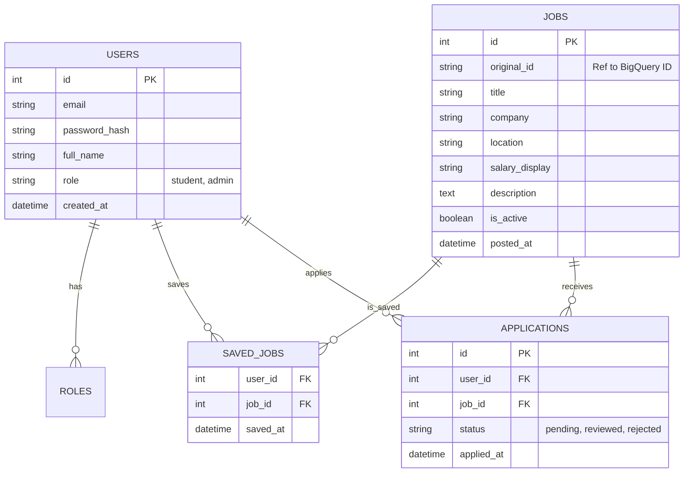

# Hybrid Data Model Design

This document outlines the data schemas for the two main components of the system:
1.  **Analytics & ML** (Google BigQuery)
2.  **Web Application** (Relational Database - PostgreSQL/MySQL)

## 1. Analytics Schema (Google BigQuery)

This layer stores raw and processed data for analysis and machine learning.

### `raw_jobs` (Table)
Stores raw JSON data from crawlers.
- `id` (STRING): Unique ID
- `source` (STRING): 'topcv', 'itviec', 'vietnamworks'
- `crawled_at` (TIMESTAMP)
- `data_json` (JSON): Full original JSON object

### `processed_jobs` (Table)
Standardized data for analysis.
- `job_id` (STRING): Unified ID
- `title` (STRING)
- `company` (STRING)
- `salary_min` (FLOAT)
- `salary_max` (FLOAT)
- `currency` (STRING)
- `locations` (ARRAY<STRING>)
- `skills` (ARRAY<STRING>)
- `experience_years` (FLOAT)
- `description` (STRING)
- `created_at` (TIMESTAMP)

### `ml_predictions` (Table)
Stores results from ML models.
- `job_id` (STRING)
- `predicted_salary` (FLOAT)
- `skill_trend_score` (FLOAT)
- `model_version` (STRING)
- `prediction_date` (TIMESTAMP)

## 2. Web Application Schema (Relational DB)

This layer supports the Student/Admin website features.

## Data Flow
1.  **Ingestion**: Crawlers -> GCS (Raw JSON)
2.  **Load**: GCS -> BigQuery (`raw_jobs`)
3.  **Process**: BigQuery SQL/Python -> `processed_jobs`
4.  **Sync**: `processed_jobs` (Active only) -> Web App DB (`JOBS` table)
5.  **Analytics**: Admin Dashboard queries BigQuery for complex reports.
